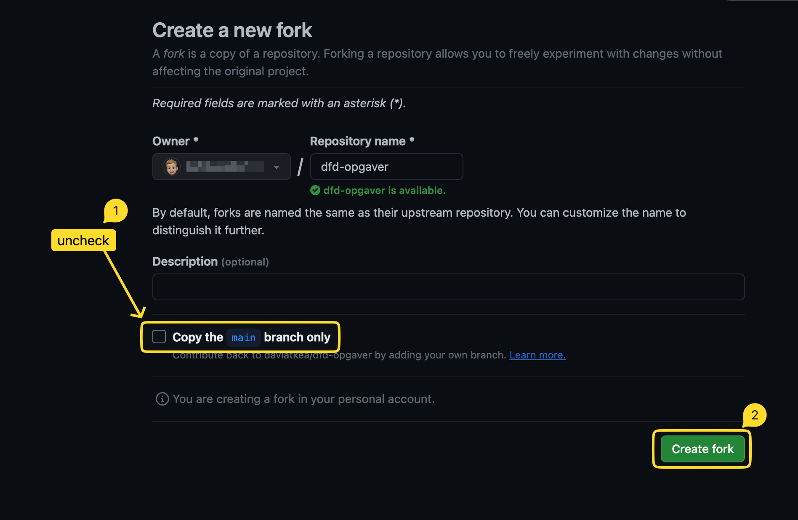
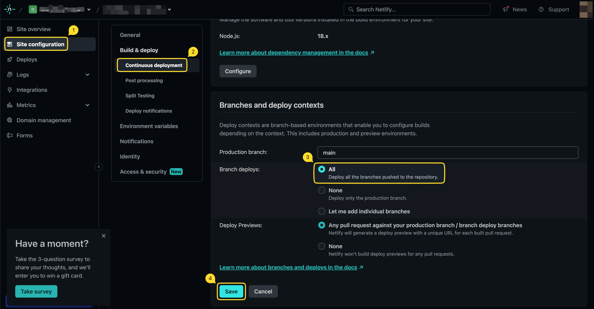

<<<<<<< HEAD
# **Responsive Container**
=======
# Frontend Design - Opgaver

> [!IMPORTANT]  
> Følg instruktionerne, før du kloner.
>>>>>>> 87622084f70ac73d8bef0844982147b298840f1f

## Formål

<<<<<<< HEAD
Formålet med denne opgave er at give dig en forståelse af, hvordan container queries kan bruges til at skabe fleksible og adaptive layouts, der tilpasser sig forskellige containerstørrelser. Du skal udforske, hvordan container queries kan ændre layoutet afhængigt af containerens bredde.
=======

1. Fork alle branches (fold ud for at se hvordan)

2. Klon det forkede repository

3. Forbind med Netlify og sørg for, at deployment sker fra alle branches (fold ud for at se mere)

Du er nu klar til at gå i gang med opgaverne. Når du skal lave en øvelse, så vælg denne ved at skifte til den relevante branch (se liste over øvelser nedenfor).
>>>>>>> 87622084f70ac73d8bef0844982147b298840f1f

## Ressourcer

<<<<<<< HEAD
- [Getting started with container queries](https://developer.mozilla.org/en-US/blog/getting-started-with-css-container-queries/)

## Opgavebeskrivelse

Du skal arbejde med denne branch, som indeholder et HTML-dokument og en tilhørende stylesheet, der er delvist implementeret. I denne opgave skal du færdiggøre implementeringen ved at følge de kommentarer, der allerede er tilføjet i CSS-filen (se, hvordan det skal ende nederst).

Identificer de elementer, der skal fungere som containere, og anvend `container-type: inline-size`. Dette vil gøre det muligt at anvende container queries på disse elementer.

Når `ul`-containerens bredde overstiger `700px`, skal du ændre layoutet:

- Indstil `ul` til at vise to kolonner.
- Sørg for, at det første barn spænder over begge kolonner ved at bruge `grid-column: span 2`.

Brug container queries til at ændre layoutet af `article`, når containerens bredde overstiger `500px`:

- Indstil `article` til at have to kolonner.
- For hvert andet `article`-element skal du sætte `order: 1;` på billedet (`img`) for at ændre rækkefølgen af indholdet.

Når du har implementeret ovenstående ændringer, eksperimenter med at ændre størrelsen på containere for at observere, hvordan layoutet dynamisk tilpasser sig.

### Specifikke mål

- Forstå, hvordan container queries kan forbedre både brugeroplevelsen og udvikleroplevelsen ved at skabe mere fleksible og kontekstsensitive layouts, der automatisk tilpasser sig forskellige containerstørrelser.
- Arbejde med og ændre eksisterende CSS

> [!NOTE]  
> **Bemærk, at denne branch inkluderer et lille CSS Reset.**

## Aflevering

Find linket til din løsning på Netlify og aflever det på Fronter.

Link-struktur: **responsive-container--**[Dit unikke netlify link].netlify.app/

=======
### Selectors

- No Classes ("no-classes")

### Layout

- Grid Breakout ("breakout")
- Scrolling Container ("scrolling-container")
- Subgrid Caption ("subgrid-caption")
- Subgrid Card ("subgrid-card")
- Responsive Container ("responsive-container")

### UI Patterns

- Flow Space-teknikken ("flow-space")
- Styling af tekstindhold ("text-styling")
- Card UI ("card-ui")
- Animated Accordion w/ details/summary ("details-accordion")

### Code in the Dark

- Code in the Dark 1 ("citd-1")
- Code in the Dark 2 ("citd-2")

### Challenges

- Animated Accordion w/ grid ("accordion")
- Card Expand ("card-expand")
- Sticky Labels ("sticky-labels")

## Ressourcer

- [CSS Reset](/resources/reset.css)
- [CSS Patterns](/resources/patterns.md) (Opdateres løbende...)
- [CSS Anti-Patterns](/resources/anti-patterns.md) (Opdateres løbende...)
>>>>>>> 87622084f70ac73d8bef0844982147b298840f1f
